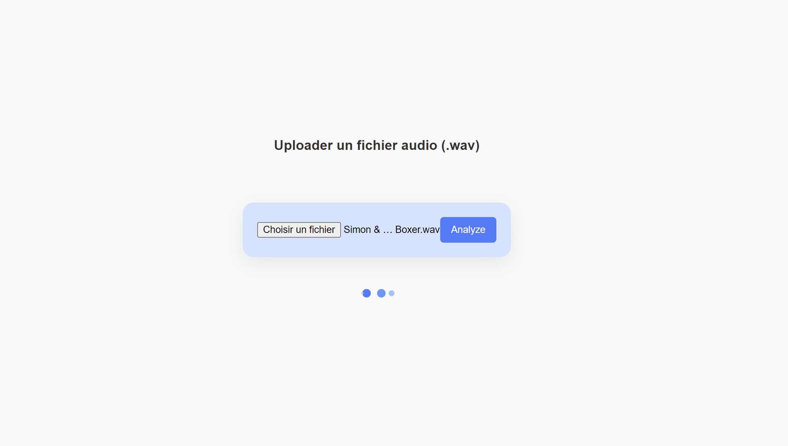

# Music Genre Classification with AI🎶

This **[model](https://huggingface.co/gastonduault/music-classifier)** classifies music genres based on audio signals. It was fine-tuned on the
**[music_genres_small](https://huggingface.co/datasets/lewtun/music_genres_small)** dataset.

This project leverages the **[Wav2Vec2](https://huggingface.co/facebook/wav2vec2-large)** model from Facebook, a state-of-the-art transformer-based architecture for audio processing, to classify music genres. The model is fine-tuned on a dataset of music samples to predict the genre of a given audio file.

The repository includes:
- Preprocessing of audio data.
- Flask service for a website for try the model
- Training scripts for fine-tuning the Wav2Vec2 model.
- Model evaluation and performance analysis.
- Deployment of the trained model for real-world predictions.
---
## Getting Started
### Prerequisites
- Python 3
- `pip install transformers werkzeug flask torch librosa`

### Run API Flask
- `Python app.py` (run app.py)
- website on **[http://localhost:5000](http://localhost:5000)**

---
## 🖥️ Access the Model

➡️ **[Fine-Tuned Model gastonduault/music-classifier](https://huggingface.co/gastonduault/music-classifier)**

### Metrics
- **Validation Accuracy**: 75%
- **F1 Score**: 74%
- **Validation Loss**: 0.77

---

## 📊 Dataset
The dataset used for training is `lewtun/music_genres_small` from Hugging Face's datasets library. It contains diverse audio tracks labeled with genres.

**Classes:**
- `Electronic`
- `Rock`
- `Punk`
- `Experimental`
- `Hip-Hop`
- `Folk`
- `Chiptune / Glitch`
- `Instrumental`
- `Pop`
- `International`

---

## 📂 Repository Structure
- **`training.py`**: Script for training and evaluating the Wav2Vec2 model ***(with Google colab)***.
- **`prediction.py`**: Script to make predictions on new audio files using the trained model.
- **`app.py`**: Python API with Flask framework for testing the model.

---
## The interface of testing
